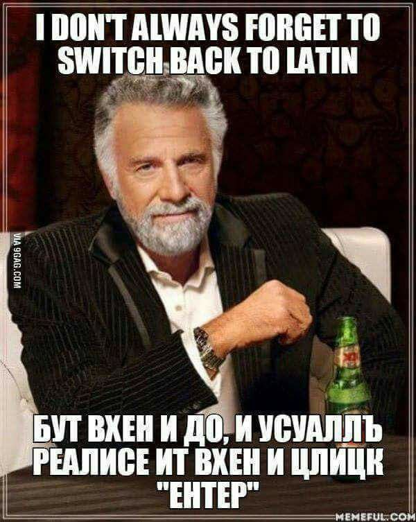

# English to Bulgarian Keyboard Converter

🧠 **Purpose:**  
This web application helps users convert accidental English keystrokes back to Bulgarian text, depending on the keyboard layout they were intending to use (Typewriter or Phonetic).

🌐 **Live Demo:**  
[english2bds.onrender.com](https://english2bds.onrender.com/)

## ✅ Features

- Converts mistyped English text into proper Bulgarian based on:
  - **Typewriter layout**
  - **Phonetic layout**

## ✍️ Examples

| Mistyped English Input                  | Layout     | Output                         |
|----------------------------------------|------------|--------------------------------|
| `Riud; jfld od e kd ur,r.r[d`          | Typewriter | `Искам това да е на кирилица` |
| `Iskam towa da e na kirilica`          | Phonetic   | `Искам това да е на кирилица` |

*It depends on which Bulgarian layout you were using before accidentally switching to English.*

## ⚙️ Tech Stack

- Frontend: HTML/CSS, W3 CSS, Bootstrap/JS]
- Deployment: [Render](https://render.com)

## 📄 License

[MIT License](LICENSE)

## 🙋 Contact

Feel free to open an issue or contact me at: [atanas.chebishev@gmail.com]\

